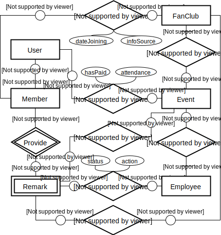
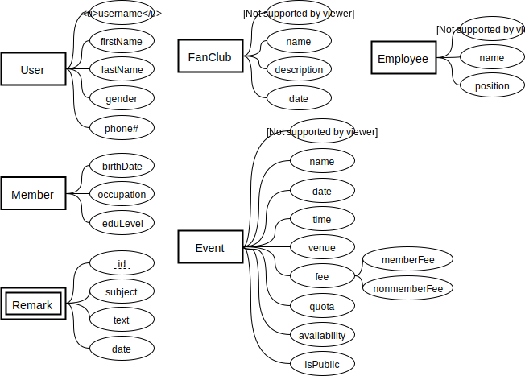

# Project Task 1

COMP 3311	**Database Management Systems**  
2018 Summer, HKUST

Author: Weiyang Liu  
Student ID: 20413306

## Part 1: E-R Diagram (w/o Entity Attributes)

## Part 2: Entity Attributes

## Part 3: Assumptions

1. A remark can have no employee following up it, and an employee can follow up multiple remarks.
2. A remark can be about either one club or multiple events.
3. A fan club can hold no event and have no members.
4. An event can have no one participating, and a user can join no event.
5. For a user, only his primary phone number is stored.
6. For a member, only his primary occupation is stored.
7. For an employee, only his primary position is stored.